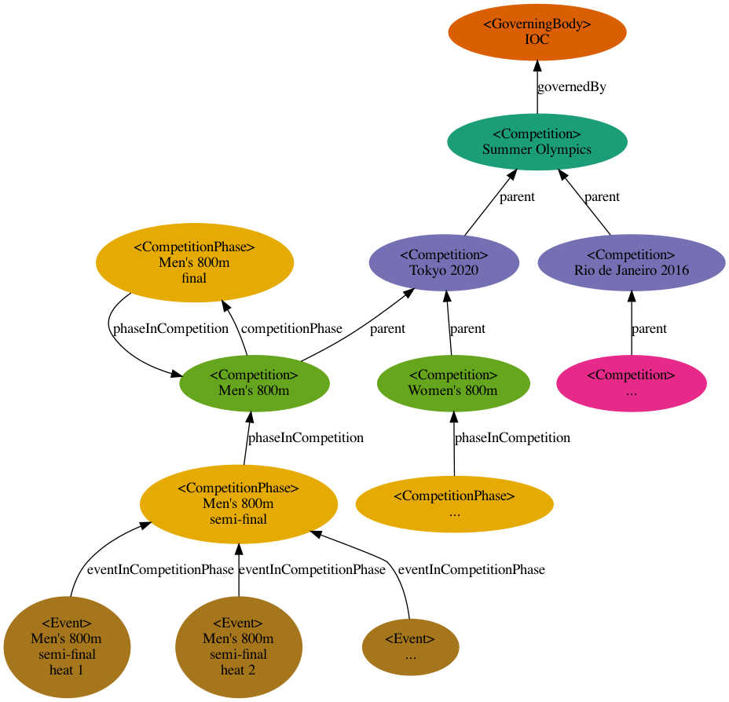
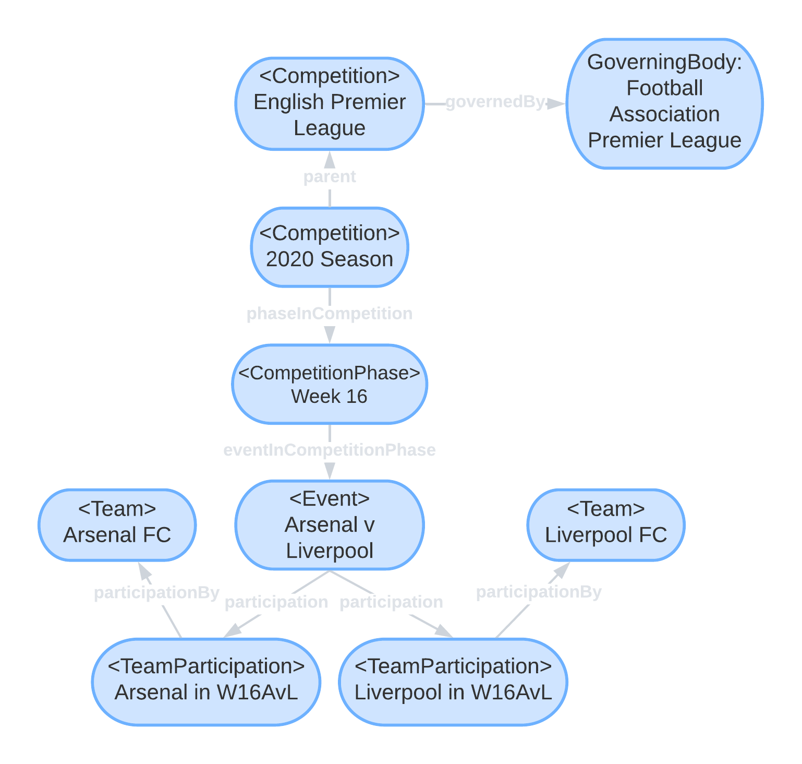
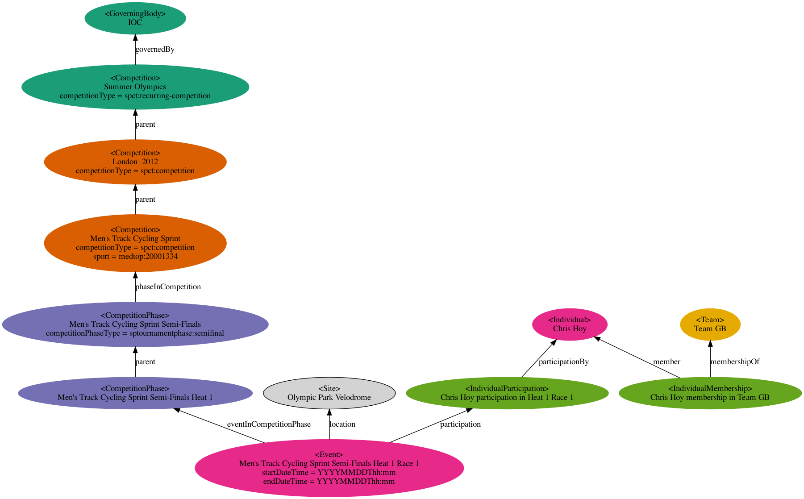

# Examples

## Example data generated from SportsML

To develop IPTC Sport Schema, we have created an XSLT stylesheet thet converts from
IPTC SportsML documents to IPTC Sport Schema triples.

The resulting data files are available in three standard RDF formats:
* N3 (raw triples)
* Turtle (easier to read)
* JSON-LD (more suitable for embedding into web pages).

## Example instance diagrams

To help people to understand how the IPTC Sport Schema data model works, we have created
a few examples showing how instance data relates to some common scenarios, and some more
complicated scenarios, found in the world of sports results and sports data.

### An athletics competition

### A soccer competition

### BBC Olympics example

