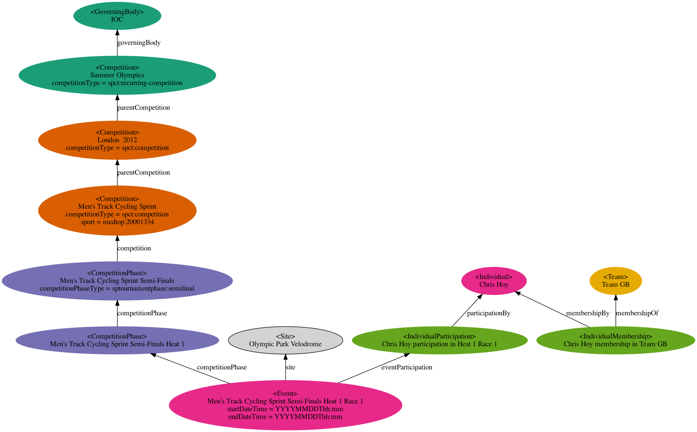

# Examples: Olympics

This takes the example instance diagram from the
[BBC Sport Ontology](https://iptc.org/thirdparty/bbc-ontologies/sport.html)
and shows how it would be represented using the IPTC Sport Schema model.

