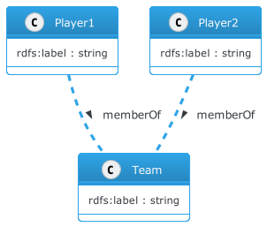

# IPTC Sport Schema overview

The IPTC Sport Schema aims to be simple and comprehensive, while re-using the
main components from the IPTC SportsML standard.

An important property of a RDF-based data model, as opposed to an XML
Schema such as SportsML, is that we must assume that the data persists in the
database, so all queries must be qualified by filters to only match a given
event, sport, league, date etc.

On the other hand, an XML approach treats every data file as a standalone
document which covers a particular piece of information.

This has led to us creating several generic structures which allow us to
capture richer information about players, teams and events.

For example, in a SportsML document, it is sufficient to say "Player A and
Player B play for Team 1", so we could imagine a relationship like the
following:

But in a world where every fact about every sports event, team, player and
statistic may be added to an ever-growing database, we need to specify more
information about the relationship. What happens when a player switches teams?
How about when a player plays simultaneously for a league team and the national
team?

To solve this, we introduce the concept of a *Membership*, a separate object
which can include more details such as a "from" and "to" date:

