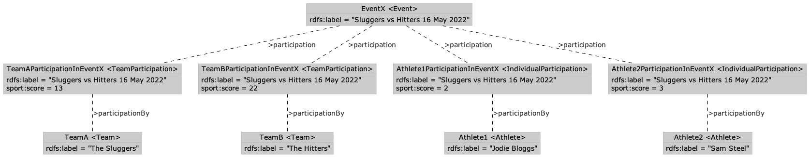

# IPTC Sport Schema overview

The IPTC Sport Schema aims to be simple and comprehensive, while leveraging the structures and
patterns developed over 10+ years of knowledge and experience in IPTC's SportsML standard.

This guide explains some of the core structures and patterns used in the IPTC Sport Schema. 

## Key concepts

The following concepts comprise the "world" described by the IPTC Sport Schema model.

### Competitions, Events and Actions

To use a simple football/soccer example,  an **Action** (e.g. a goal) is part of an **Event**
 (e.g. a football match) which itself is part of a **Competition** (e.g. the Premier League 2023
season).

To use a tennis exmple, a serve (**Action**) is part of an **Event** (the tennis match) which may
be part of a **Competition** (the French Open Women's Title). This Competition can be part of
a "parent **Competition**" called Roland Garros (aka the French Open), which may itself be
part of a parent **Competition** called the "ATP Tour 2023".


More formally, a **Competition** is a collection of **Events** culminating in a competitive goal: a
championship, a medal etc. Examples are the Men's 800M in the Summer Olympics, the NBA 2023 season,
the Champions League 2023 season and the 2023 Tour de France.

Each of those **Competition**s is comprised of competitive events within which competitive,
statistics-generating sports actions take place. So while the Men's 800M is a Competition (toward a
single gold medal), a race or heat in that **Competition** is an **Event**. The Summer Olympics can
themselves be characterized as a competition within which national **Team**s compete in the medal
table, according to aggregate medal counts.

### Action versus Event

**Event**s are units within which competitive action takes place (and from which statistics are
generated). **Action**s are the specific competitive occurrences that comprise the overall event.
These can be goals, kickoffs, passes, penalties or even video reviews. These are the basic units
of a competitive event from which statistical reports can be generated.

### Participation

In IPTC Sport Schema, **Athlete**s and **Team**s are distinct from their "performances", which are
stored as separate queryable objects. To be generic and include the participation of officials,
coaches and managers, as well as athletes and teams,  we call the object a **Participation**. So
a Participation links an Agent (

**Participation**s are the object to which all scores and statistics are attached.

### Membership

Athletes move from league to league and team to team. Some even play more than one sport. SportSchema's Membership class tracks an athlete's career across time.

### Summary

The model describes three component parts that make up the domain of sports data:
* The structure of a competition. For example matches played in a round, which is itself within a competition instance, that is part of a competition series.
* The participation in a competition, event or action. Teams, atheletes and officials actively participate in competitive events and generate stats about that participation.
* Membership in of a team. Particpation by individuals can be as part of a team. This is expressed in the membership part of the model.

The follow sections describe the patterns used for each of these component parts of the model.


### Competition, event and action: building blocks to describe any competition structure

Competitions are many and varied in structure. In the process of designing the model it was clear there was a need for a flexible and modular appraoch.

The key class is the event this represents the lowests partisipatable thing that has outcome. Things like matches and races that have a result. Activities are more granular than events but do not have an outcome or result in their own right. An example would be a match (event) versus a goal scored (action).

Events will always be part of a competition. In rare cases a competition might have a single event but in the majority of cases a event will be part of a larger competition structure. An event is assocaited with the most granular level of competition. It might be a phase of a competition like a knockout-round or heat. This phase is then assocaited with the overaching competition which itself might be part of a recurring competition series.


### Participation: A container for statistics

When an athlete or a team takes part in an event, we want
to record statistics about each athlete's individual contributions to the event:
goals kicked, penalties received etc.
 
Separately, we want to record the team's contributions, including of course the team's score.

To handle this need, we have introduced the concept of a *Participation* which links people and teams to events.

We define a generic parent *Participation* class and subclasses for *IndividualParticipation* and *TeamParticipation*.

The TeamParticipation object comes into existence as soon as a team is scheduled to compete in an event. The IndividualParticipation comes into existence when the team member is added to the line-up for a team participating in an Event.



### Linking people to teams: the "Membership" class

In a SportsML document, it is sufficient to say "Athlete A and
Athlete B play for Team 1", so we could imagine a relationship like the
following:


But in a world where every fact about every sports event, team, athlete (player) and
statistic may be added to an ever-growing database, we need to specify more
information about the relationship. Otherwise, what would happen when an athlete switches teams?
Or how would we represent a athlete that plays simultaneously for a league team and the national team?

To solve this, we introduce the concept of a *Membership*, a separate object
that sits between Athlete and Team which can include more details such as a
"from" and "to" date:


In this way, we can represent things such as:
* A coach that works with more than one team at the same time, even in different sports
* An athlete that moves from one team to another over the course of their career
* An athlete that switches sports completely! (Michael Jordan, for example, switched from NBA Basketball to Major League Baseball, and back again)

This approach makes querying slightly more difficult, but not much more. In SPARQL, a query might look like the following:

```
SELECT ?teamName ?athleteName ?athletePosition ?dob ?uniformNumber
WHERE
{
    ?athlete rdf:type sport:Athlete ;
            rdfs:label ?athleteName .
    ?membership rdf:type sport:IndividualMembership ;
                sport:membershipBy ?player ;
                sport:membershipOf ?team .
    ?team rdf:type sport:Team ;
          rdfs:label ?teamName ;
          sport:membership ?membership .
    OPTIONAL { ?membership sport:positionRegular ?athletePosition . }
    OPTIONAL { ?player sport:dateOfBirth ?dob . }
    OPTIONAL { ?membership sport:uniformNumber ?uniformNumber . }
    FILTER (?team = <http://example.com/Team/T2>) # Aston Villa
}
```

See the [example queries](../queries/) for more examples.


